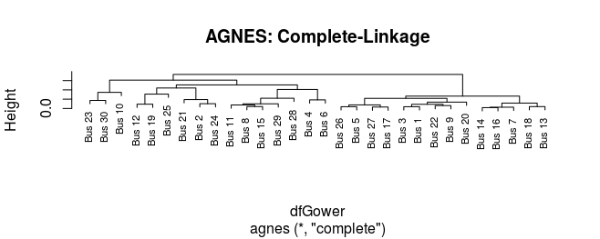
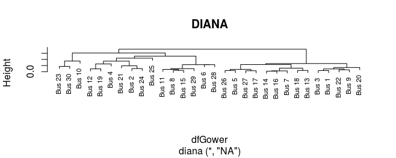
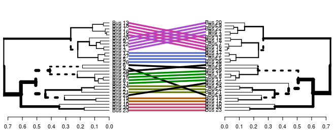
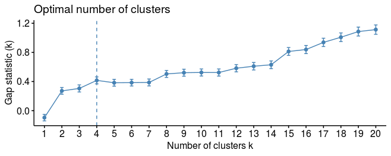

# Satellite-Complexity

# Table of Contents

1. [Introduction](#introduction)

2. [Dataset](#dataset)

3. [Hierarchical Clustering](#hc)
    
    a) [AGNES](#agnes)
    
    b) [DIANA](#diana)
    
    c) [Comparisons](#comparisons)
    
    d) [Choosing N-Clusters](#nclusters)
    
4. [Complexity Factor](#complexity)

5. [Results & Conclusion](#conclusion)

<a name="introduction"></a> 
# Introduction

How do you estimate the cost a new, more complex version of an existing satellite? Typically, when estimating the first theoretical unit cost (T1), an analyst will simply multiply the old T1 cost of the existing satellite by a *complexity factor*, which is derived by meeting with the Program Manager(s) and technical team to discuss an appropriate value. This way of doing business can be very subjective and prone to much uncertainty. Fortunately for me, one of my more clever colleagues devised a way to capture complexity for satellite payloads in a more objective manner using *hierarchical clustering* (HC), a technique that I attempted to replicate to capture complexity at the bus level of the satellites my team and I were tasked to estimate.

<a name="dataset"></a> 
# Dataset

The real data I used is proprietary, so I'm going to be using replicated "fake" data that will behave in a manner similar to the real thing. There will be some simplifications of course (e.g. no N/As, data pre-cleaned, and fewer variables used), however the code used is the same except for additional cleaning script that wouldn't be relevant for pre-cleaned data.

For this analysis, the variables chosen to categorize satellites by complexity will be the following:

1. **Orbit:** There are two orbits listed: LEO and GEO (Low Earth Orbit and Geostationary Orbit, respectively). Satellites in LEO orbit     are more complex than ones in GEO because, since there are more of them in order to cover larger geographical areas, they require more ground antennas to have successful communicaiton operations. This can get expensive, especially when ground antennas need to be installed at varying elevations.

2. **Mission Type:** There are four mission types: Scientific, Experimental, Environmental, and Communications. Missions involving research (i.e. Scientific and sometimes Experimental) typically use more current technology in order to enhance performance and measurement accuracy. 

3. **Bus Type:** There are two bus types: Standard and Unique. Unique busses require more nonrecurring development in order to be able to perform more unique/specific mission CONOPs.  

4. **Level of Protection:** There are two levels of protection: Low and Medium. Satellites with higher levels of protection are thought to require more nonrecurring development in order to be able to enhance durability. 

5. **Date Difference:** This is a user created numerical variable that measures the number of days between when the satellites' contract was awarded to a vendor and the first launch date. The logic being that more complex satellites typically take longer to develop, as well as have delays in their program acquisition scheduling.

Now on to the actual code. First, load the required packages, which for this project are the following...

```R
library(readxl)
library(tidyverse)
library(factoextra)
library(dendextend)
library(cluster)
```


Now fetch and organize the data (xlsx file). It's important that you randomize the data as well because hierarchical clustering algorithms are sensitive to the order of the data.

```R

Fake_Bus_Data = read_excel("Fake Bus Data.xlsx")

df = as.data.frame(Fake_Bus_Data)

# We're going to want the rows labeled by program name for our dendrogram charts later.

row.names(df) = df$program_name
df$program_name = NULL

#The "for-loop" below runs through each column and sets each cell's value to either 
#"numeric" if the value checks out as a number, or a as a factor otherwise. For some 
#reason this was necessary to do because importing the data from Excel to R didn't carry
#over the proper categorization of the datum points.

for (i in 1:ncol(df)) {
    if(is.numeric(df[1,i]) == TRUE)
      df[,i] = as.numeric(df[,i])
    else
      df[,i] = as.factor(df[,i])
}

## Shuffles the data because clustering algorithms are 
## sensitive to the order of the data.

set.seed(1)
df = df[sample(nrow(df)), ]

```
<a name="hc"></a> 
# Hierarchical Clustering

The first thing needed is to measure how similar/different each datum point is from the rest, which requires that a disparity matrix be generated using [Gower's distance](https://www.math.vu.nl/~sbhulai/papers/thesis-vandenhoven.pdf) to measure the disparity. This is trivial to do in R.

```R
dfGower = daisy(df, metric = 'gower')
```

Now a clustering algorithm must be chosen; the two main types that will be used are *agglomerative* and *divisive* clustering, or AGNES and DIANA for short. Typically, you want to use AGNES for finding smaller clusters and DIANA for larger ones, but for my purposes I'm going to look at both and compare.

<a name="agnes"></a> 
## AGNES

In a nutshell, AGNES works like this: It groups datum points most similar to each other into clusters, then it groups those clusters with other clusters most similar to each other, and so on until there are no more clusters to group. To do this, AGNES requires that you choose a *linking* algorithm to link datum points/clusters with other datum points/clusters. There are a few ways to do this, so it's best to try them all out and see which one is producing a stronger cluster structure as measured by the agglomeration coefficient (index between 0 - 1 with values closer to 1 indicating stronger cluster structures). 

```R
linkMethod = c("average", "single", "complete", "ward")

## Function to fetch agglomeration coefficients

ac = function(algorithm){agnes(dfGower, method = algorithm)$ac}
map_dbl(linkMethod, ac)

[1] 0.8054316 0.7022997 0.8615475 0.9376650
```
[Ward's method](https://en.wikipedia.org/wiki/Ward%27s_method) does the best (it usually does), however it cannot be used because Ward's method required that the distance measure is euclidean and metric, both of which Gower's dissimilarity is not. Thus, the next best alternative will be the [complete-linkage](https://en.wikipedia.org/wiki/Complete-linkage_clustering) 

```R
agnesCluster = agnes(dfGower, method = 'complete')
pltree(agnesCluster, cex = 0.7, main = "AGNES: Complete-Linkage")
```


As quick overview of the dendrograms: Notice that the vertical axis is labeled "height", which is the measure of disimilarity between the data being clustered. This means the higher the branches (vertical lines) are before they're fused, the more dissimilar the datum points are within the cluster.

<a name="diana"></a> 
## DIANA

DIANA is very similar to AGNES, but the difference is DIANA is the inverse of AGNES: It starts off by having every datum point in a single cluster, then breaks the cluster into other clusters that are the most different from eachother, and so on until there are only individual datum points left. Like AGNES, DIANA as a metric like the AC called the "Divisive Coefficient" (DC) where values closer to 1 indicate stronger cluster structures. Below is the code to retrieve the DC value and the dendrogram.

```R
diana(dfGower)$dc
[1] 0.8499909

dianaCluster = diana(dfGower)
pltree(dianaCluster, cex = 0.7, main = "DIANA")
```



<a name="comparisons"></a>
## Comparisons

Ultimately, regardless of what AC or DC values generated, choosing AGNES over DIANA, or vice versa, depends on how you want your data clustered, as well as which algorithm clusters your data in a manner that makes that leads to a conclusion that makes sense (although be careful of following this guideline because often enough the right conclusions can appear wrong at first, but are really presenting a conclusion that happens to be counterintuitive). That being said, there is a way to cross-check the two methods to see how consistent their clusters are when compared to one another. Using the "entaglement()" function, we receive a value between 0 and 1, with 0 representing no entanglement and 1 representing full entanglement. The closer to 1 the entanglement value is the more important the decision is between choosing which clustering algorithm is appropriate for representing your results. 

```R
agnesDendro = as.dendrogram(agnesCluster)
dianaDendro = as.dendrogram(dianaCluster)

entanglement(agnesDendro, dianaDendro)
[1] 0.0784724

tanglegram(agnesDendro, dianaDendro)
```


As highlighted in the engtanglement value and image above, choosing DIANA or AGNES for this exercise will yield similar results. In the real world the results aren't so clean and there are vast differences in scope between military and commercial busses, as well as vast intra-differences between military busses, thus (IMO) AGNES would be the appropriate choice for reflecting both the inter/intra-differences between military and commercial/other military clusters of satellite busses.

<a name="nclusters"></a> 
## Choosing N-Clusters

The last thing needed in order to apply HC to our complexity analysis is to pick the optimal number of clusters to group our datum points in. There are three ways to measure this: Elbow-method, average silhouette method, and the gap statistic (info on each method can be found [here](https://uc-r.github.io/kmeans_clustering#elbow). The methods, although described for K-Means, can also be applied to HC). This is very easy to do with the 'factoextra' package.

```R
hcut_agnes = function(data, k){hcut(data, k, hc_method = "complete", 
                                    hc_func = "agnes")}
hcut_diana = function(data, k){hcut(data, k, hc_method = "complete", 
                                    hc_func = "diana")}

fviz_nbclust(as.matrix(dfGower), FUN = hcut_agnes, k.max = 20, nboot = 500, 
             method = "wss")
fviz_nbclust(as.matrix(dfGower), FUN = hcut_diana, k.max = 20, nboot = 500, 
             method = "wss")

fviz_nbclust(as.matrix(dfGower), FUN = hcut_agnes, k.max = 20, nboot = 500,
             method = "silhouette")
fviz_nbclust(as.matrix(dfGower), FUN = hcut_diana, k.max = 20, nboot = 500,
             method = "silhouette")

fviz_nbclust(as.matrix(dfGower), FUN = hcut_agnes, k.max = 20, nboot = 500,
             method = "gap_stat")
fviz_nbclust(as.matrix(dfGower), FUN = hcut_diana, k.max = 20, nboot = 500, 
             method = "gap_stat")
```




The elbow method says 4 clusters is optimal, average silhouette says 2, and the gap statistic says 4. For this specific purpose, a cluster of 2 would be useless (which will be elaborated on later), so choosing 4 clusters seems best. Below is an image of how the data would be group based on our chosen N clusters.

```R
clusters = hcut(as.matrix(dfGower), 4, hc_func = "agnes", 
                   hc_method = "complete")
 
fviz_cluster(clusters)
```


<a name="complexity"></a> 
# Complexity Factor

Now on to the "meat" of the project. Since there are 4 clusters, there needs to be three additional category columns added to the dataframe to categorize the datum points by complexity. I'll then run a regression to test the statistical and cost significance of the new categorical dummy variables.

A bit of background: Typically, satellite T1 bus costs follow a nonlinear relationship with the bus's weight, so a log-log regression is best used to capture a linear relationship between the percent change in T1 costs due to a percent change in the bus's weight.   

logT1 = &beta;<sub>0</sub> + &beta;<sub>1</sub>log Weight 

An early look at our linear model in R with just logged weights will illuminate in more detail.

```R
df$log_t1 = log(df$t1_k)
df$log_weight = log(df$weight_lbs)

lmFit = lm(log_t1 ~ log_weight, data = df)
summary(lmFit)

Call:
lm(formula = log_t1 ~ log_weight, data = df)

Residuals:
     Min       1Q   Median       3Q      Max 
-0.96477 -0.42143 -0.01532  0.40436  1.14038 

Coefficients:
            Estimate Std. Error t value Pr(>|t|)    
(Intercept)  -0.8027     1.1922  -0.673    0.506    
log_weight    1.1354     0.1864   6.090 1.44e-06 ***
---
Signif. codes:  0 ‘***’ 0.001 ‘**’ 0.01 ‘*’ 0.05 ‘.’ 0.1 ‘ ’ 1

Residual standard error: 0.5151 on 28 degrees of freedom
Multiple R-squared:  0.5698,	Adjusted R-squared:  0.5545 
F-statistic: 37.09 on 1 and 28 DF,  p-value: 1.436e-06

```

As you can see, the overall model and coefficient for the variable "log_weight" are highly significant (F-statistic = 37.09 and p-value < 0.001, respectively) with ~ 55% (Adj. R-squared) of the variation being explained by the independent variable.

Now we'll run another linear model with the categories/clusters as dummy variables while keeping the log_weight variable as well.

```R
## Matches each datum point with its respective cluster

dfCat = data.frame('program_name' = clusters$order.lab,
                   'category' = clusters$cluster)
row.names(dfCat) = dfCat$program_name
dfCat$program_name = NULL

## Combines the two dataframes into one

df2 = merge(df, dfCat, by = 'row.names')
row.names(df2) = df2$Row.names
df2$Row.names = NULL

df2$cat1 = ifelse(df2$category == 1, 1, 0)
df2$cat2 = ifelse(df2$category == 2, 1, 0)
df2$cat3 = ifelse(df2$category == 3, 1, 0)

df2$log_t1 = log(df2$t1_k)
df2$log_weight = log(df2$weight_lbs)
```

<a name="conclusion"></a> 
# Results & Conclusion

Running our new linear model in R will get us our final results.

```R
lmFit2 = lm(log_t1 ~ log_weight + cat1 + cat2 + cat3, data = df2)
summary(lmFit2)

Call:
lm(formula = log_t1 ~ log_weight + cat1 + cat2 + cat3, data = df2)

Residuals:
     Min       1Q   Median       3Q      Max 
-0.88793 -0.36871 -0.00764  0.37291  0.77559 

Coefficients:
            Estimate Std. Error t value Pr(>|t|)    
(Intercept) -0.92231    1.20574  -0.765   0.4515    
log_weight   1.14185    0.19190   5.950 3.27e-06 ***
cat1         0.63600    0.34691   1.833   0.0787 .  
cat2         0.06309    0.24170   0.261   0.7962    
cat3        -0.07145    0.27972  -0.255   0.8005    
---
Signif. codes:  0 ‘***’ 0.001 ‘**’ 0.01 ‘*’ 0.05 ‘.’ 0.1 ‘ ’ 1

Residual standard error: 0.5026 on 25 degrees of freedom
Multiple R-squared:  0.6343,	Adjusted R-squared:  0.5758 
F-statistic: 10.84 on 4 and 25 DF,  p-value: 3.089e-05
```
The "cat1" cluster is the only category statistically significant amongst the other 4 (the unlisted fourth cluster effects would be captured by the intercept, which isn't significant either). The F-statistic is a bit weaker due to the inclusion of two other insignificant variables, however the standard error and adj. r-squared have been lowered/increased slightly, suggesting that model is a (slightly) better fit than our original log-log model with just log_weight as the only explanatory variable (which also doesn't seem to be very sensitive to the inclusion of the dummy variables when looking at its t-statistic and standard error). Overall, the model suggests that if a satellite bus is grouped within the first cluster, a 1% increase in the bus's weight will increase its T1 costs by ~0.64%. Thus, our "complexity factor"
